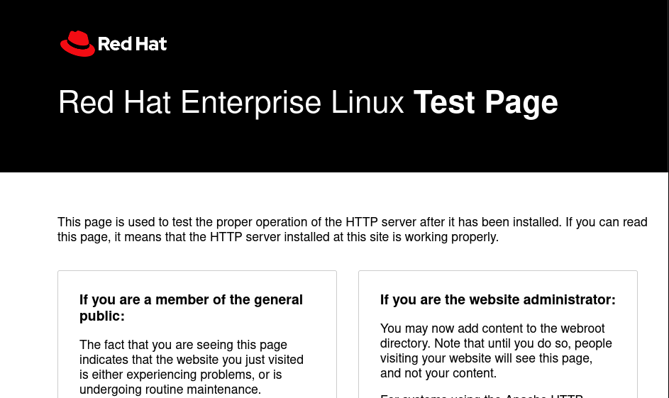

# ITOP INSTALL & CONFIGURATION

---

## Introduccion

**iTop** (IT Operations Portal) es una solución de gestión de servicios de TI (ITSM) que ayuda a las organizaciones a gestionar su infraestructura de TI, incidentes, problemas, cambios, solicitudes de servicio, y la CMDB (Base de Datos de Gestión de Configuración).  
Es ampliamente utilizado por empresas que desean centralizar su gestión de TI y mejorar el soporte técnico y la administración de activos.  

Algunas de las funcionalidades clave incluyen:  
- Gestión de incidentes y problemas.  
- Gestión de cambios y configuraciones.  
- Base de datos CMDB para activos y dependencias.  
- Informes y paneles personalizables.  

---

## Requisitos Especificos

> [!IMPORTANT]  
> Estos Requisitos de Hardware son Especificos de Esta Implementacion.
>
>| **OS**                      |**vCPUs**| **RAM**  | **FS** |
>|-----------------------------|---------|----------|--------|
>| RedHat Enterprise Linux 9.5 | 4 cores | 12 GB    | 10 GB  |
>
>
>### **Esquema recomendado de Particiones para Servidor Virtual (10 GB)**  
>
> | **Partición** | **Tamaño Sugerido** | **Descripción**                                                                        |
>|----------------|---------------------|----------------------------------------------------------------------------------------|
>| `/` (root)     | **7 GB**            | Contiene el sistema operativo, software principal (como iTop), y archivos esenciales.  |
>| `/home`        | **2 GB**            | Para archivos y configuraciones de usuarios locales.                                   |
>| `/boot/efi`    | **500 MB**          | Partición de arranque EFI necesaria si el servidor usa UEFI en lugar de BIOS.          |
>| `/boot`        | **500 MB**          | Para almacenar el kernel de Linux y archivos de arranque (Grub).                       |


---


## Dependecias

## **Dependencias para la Instalación de iTop**  

| **Componente**            | **Descripción**                                                                 |
|---------------------------|---------------------------------------------------------------------------------|
| **PHP**                    | Versión 7.4 o superior. Requiere varias extensiones.                            |
| **Extensiones PHP**        | - `mysqli` (para la base de datos MySQL/MariaDB)                               |
|                           | - `mbstring` (para manejar cadenas multibyte)                                  |
|                           | - `gd` (para manipulación de imágenes, útil para los informes)                |
|                           | - `xml` (para procesamiento de XML)                                           |
|                           | - `json` (para manipulación de datos JSON)                                     |
|                           | - `curl` (para realizar solicitudes HTTP desde PHP)                            |
| **Base de Datos**          | - **MySQL** 5.7 o superior o **MariaDB** 10.3 o superior.                      |
| **Servidor Web**           | - **Apache** (2.4 o superior) o **Nginx**                                        |
| **Servidor de correo**     | - Para enviar correos electrónicos (opcional para notificaciones)               |
| **Comando `composer`**     | Herramienta de gestión de dependencias de PHP. Necesaria para gestionar dependencias de iTop. |
| **Cron**                   | Para programar tareas de mantenimiento y limpieza de la base de datos (opcional). |

---

> [!NOTE]
>### **Importante:**
>- **PHP:** Asegúrate de que todas las extensiones estén habilitadas antes de la instalación. Si alguna falta, iTop podría no funcionar correctamente.
> - **Base de Datos:** La base de datos de iTop debe estar configurada antes de comenzar la instalación.  
> - **Servidor Web:** Se recomienda Apache, ya que es compatible y tiene una configuración más sencilla con iTop.


## Instalacion de Dependencias

### MariaDB

#### Paso 1: Instalar MariaDB
```bash
sudo dnf install -y mariadb-server mariadb
```
#### Paso 2: Iniciar y habilitar el servicio de MariaDB

```bash
# Iniciar el servicio
sudo systemctl start mariadb

# Habilitar para que arranque en el inicio del sistema
sudo systemctl enable mariadb
```

#### Paso 3: Verificar el estado del servicio

```bash
sudo systemctl status mariadb.service
```
- Si todo está bien, debería mostrar algo como:
```bash
Active: active (running)
```

#### Paso 4: Configurar MariaDB con mysql_secure_installation

```bash
sudo mysql_secure_installation
```
- Durante la configuración:
```
Enter current password for root: Presiona Enter si no hay contraseña.

Set root password? [Y/n]: Y para establecer una contraseña para root (itopdbpass).

Remove anonymous users? [Y/n]: Y

Disallow root login remotely? [Y/n]: Y

Remove test database and access to it? [Y/n]: Y

Reload privilege tables now? [Y/n]: Y
```
#### Paso 5: Creacion de las base de datos y del suario para itop.
 
- Base de Datos (itopdb)

```sql

CREATE DATABASE itopdb CHARACTER SET utf8mb4 COLLATE utf8mb4_unicode_ci;

```
- Db User (itop_user)
```sql
CREATE USER 'itop_user'@'localhost' IDENTIFIED BY 'itopuserpass';
```
> [!CAUTION]
> Cambia **itopuserpass** por una contraseña segura.

- Otorgar permisos al usuario sobre la base de datos

```sql
GRANT ALL PRIVILEGES ON itopdb.* TO 'itop_user'@'localhost';
```
>[!NOTE]
>Esto permite que **itop_user** tenga control total sobre la base de datos **itopdb**.

- Aplicar los cambios y salimos.
```sql
FLUSH PRIVILEGES;

EXIT;
```
---
### APACHE (HTTPD)


#### Paso 1: Instalar Apache
```bash
sudo dnf install -y httpd
```
#### Paso 2: Iniciar y habilitar Apache

```bash
# Iniciar el servicio de Apache
sudo systemctl start httpd

# Habilitar Apache para que arranque en el inicio del sistema
sudo systemctl enable httpd

```

#### Paso 3: Verificar el estado del servicio

```bash
sudo systemctl status httpd

```
- Si todo está bien, debería mostrar algo como:
```bash
Active: active (running)
```

#### Paso 4: Configurar el firewall para permitir tráfico HTTP/HTTPS

```bash
# Permitir tráfico HTTP
sudo firewall-cmd --permanent --add-service=http

# Permitir tráfico HTTPS (opcional si piensas usar HTTPS)
sudo firewall-cmd --permanent --add-service=https

# Recargar la configuración del firewall
sudo firewall-cmd --reload
```
- Verificar que Apache sirva contenido:
```
http://<tu-ip>/
```


---
### PHP Y Otras Dependencias

#### Paso 1: Instalar PHP y módulos necesarios
```bash
#habilitamos php 8.1
sudo dnf module enable php:8.1 -y


sudo dnf install -y php php-zip php-cli php-mysqlnd php-xml php-mbstring php-process php-gd  php-soap php-ldap graphviz
```
#### Paso 2: Verificar la instalación de PHP

```bash
php -v
```
- Si todo está bien, debería mostrar algo como:
```bash
Active: active (running)
```

#### Paso 4: Reiniciar Apache para aplicar cambios

```bash
sudo systemctl restart httpd
```

## Instalacion de Itop

#### Paso 1: Descargar iTop
```bash
# Cambiar al directorio web de Apache
cd /var/www/html

# Descargar la última versión de iTop desde SourceForge
sudo curl -LO https://sourceforge.net/projects/itop/files/latest/download

# Descomprimir el archivo descargado
sudo unzip download -d itop

# accedemos al directorio itop
cd itop/
```

#### Paso 2: Configurar permisos correctos para Apache
```bash
# Asignar la propiedad de los archivos a Apache
sudo chown -R apache:apache /var/www/html/itop

# Establecer permisos adecuados
sudo chmod -R 775 /var/www/html/itop

```

#### Paso 3: Crear archivo de configuración para iTop en Apache
```bash
sudo touch /etc/httpd/conf.d/itop.conf
```
- Agregamos el siguiente  Contenido:
```
<VirtualHost *:80>
    DocumentRoot /var/www/html/itop/web
    ServerName itop.local

    <Directory "/var/www/html/itop/web">
        Options Indexes FollowSymLinks
        AllowOverride All
        Require all granted
    </Directory>

    ErrorLog /var/log/httpd/itop_error.log
    CustomLog /var/log/httpd/itop_access.log combined
</VirtualHost>

```
#### Paso 4: Reiniciar Apache para aplicar cambios
```bash
sudo systemctl restart httpd
```

#### Paso 5: Verificar iTop desde el navegador
- En el navegador y accede a:
```
  http://<tu-ip>/itop
```
> [!CAUTION]
> SI ALGO NO FUNCIONA REVISAR **SELINUX**

## Configuracion


## Conclucion

